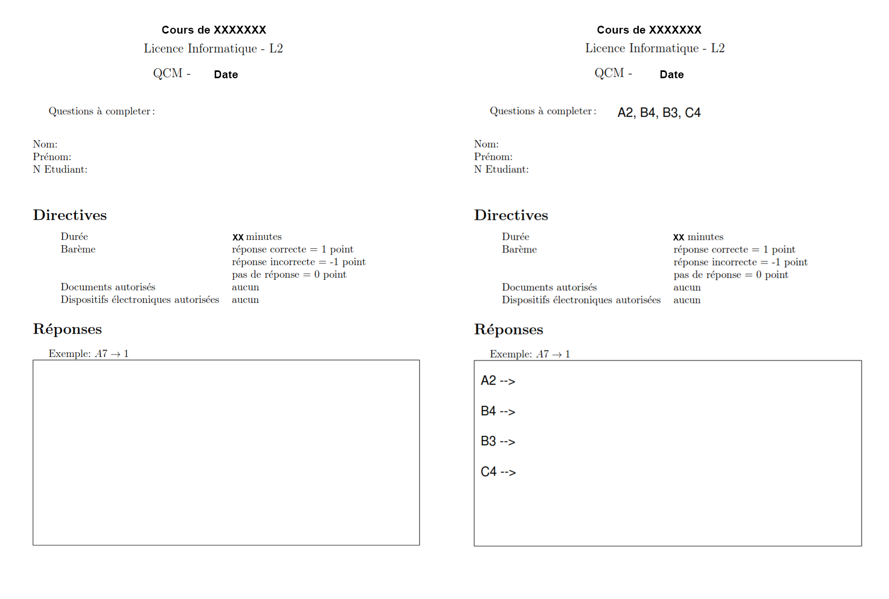

# A lazy Randomized Multiple Choice Questions Generator

Thrown around in 30 minutes from random bits of code found in various documentations feel free to reuse it. 

Input: one page pdf in data directory

Output: a pdf file with a page ofr each student in your class

## Example

